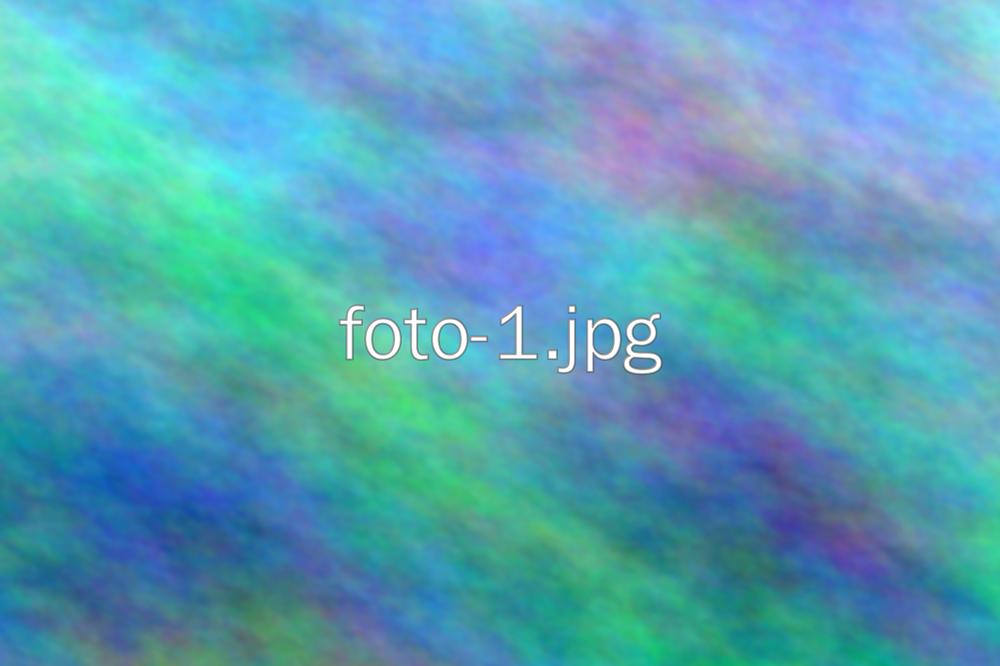
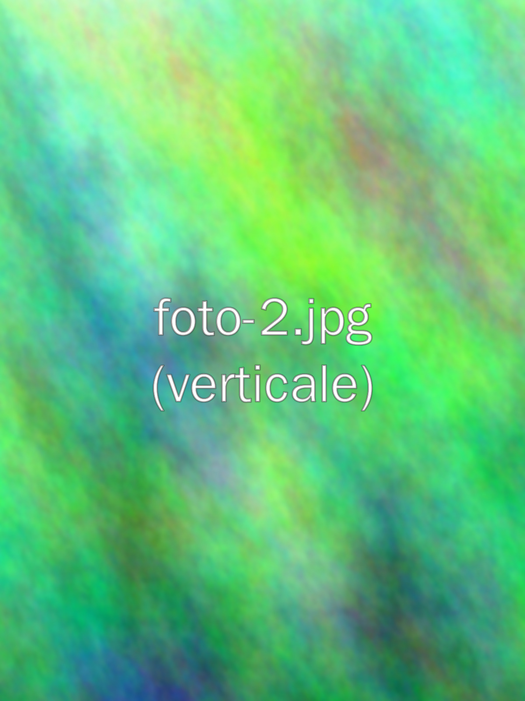

Questo è un articolo di esempio. Ogni post vive in una cartella tutta sua, insieme alle sue immagini:

```
src/content/blog/
└── esempio-post-con-immagini/
    ├── index.md        ← questo testo
    ├── copertina.jpg   ← copertina (heroImage)
    ├── foto-1.jpg
    └── foto-2.jpg
```

Il nome della cartella diventa l'indirizzo dell'articolo: `/blog/esempio-post-con-immagini/`.

## Immagine di copertina

Si indica nell'intestazione in cima al file, con un percorso relativo:

```yaml
heroImage: "./copertina.jpg"
```

## Immagini nel testo

Si inseriscono con la normale sintassi Markdown, sempre con `./` davanti al nome del file. Il testo tra parentesi quadre è la descrizione dell'immagine, utile per chi usa uno screen reader:

```md

```

Ecco il risultato:


Le foto verticali funzionano allo stesso modo:



## Cose da sapere

- Puoi caricare le foto così come escono dal telefono: durante la build vengono ridimensionate e convertite in un formato leggero (WebP).
- Se sbagli il nome di un file la build si ferma e ti dice quale immagine manca, così non pubblichi mai un'immagine rotta.
- Usa nomi di file semplici: minuscole, niente spazi né accenti (es. `tramonto-sul-mare.jpg`).
- Per pubblicare l'articolo togli la riga `draft: true` dall'intestazione.
